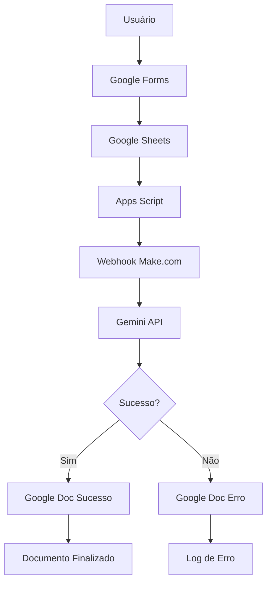

# 📚 Documentação Técnica - ComunicaIA

## Trabalho de Conclusão de Módulo

**Universidade**: UNIFECAF  
**Curso**: Tecnologia em Inteligência Artificial e Automação Digital  
**Disciplina**: Fundamentos de IA com foco em IA Generativa  
**Título**: Seu Primeiro Copiloto de IA: Criando uma Solução Inteligente com IA Generativa  
**Autor**: João Henrique Benatti Coimbra  
**Local**: Bauru/SP  
**Ano**: 2025

---

## 📑 Sumário

1. [Introdução](#1-introdução)
2. [Parte Teórica](#2-parte-teórica)
   - 2.1. [Contextualização do Desafio](#21-contextualização-do-desafio)
   - 2.2. [Justificativa para Uso de IA Generativa](#22-justificativa-para-uso-de-ia-generativa)
   - 2.3. [Modelo LLM Utilizado](#23-modelo-llm-utilizado)
   - 2.4. [Elaboração do Prompt](#24-elaboração-do-prompt)
   - 2.5. [Benefícios e Desafios](#25-benefícios-e-desafios)
   - 2.6. [Limites Éticos e de Segurança](#26-limites-éticos-e-de-segurança)
3. [Parte Prática](#3-parte-prática)
   - 3.1. [Workflow Completo e Robusto](#31-workflow-completo-e-robusto)
   - 3.2. [Implementação Técnica](#32-implementação-técnica)
4. [Melhorias Futuras](#4-melhorias-futuras)
5. [Conclusão](#5-conclusão)
6. [Referências](#6-referências)

---

## 1. Introdução

Este trabalho apresenta o desenvolvimento de um protótipo de assistente de inteligência artificial, denominado **"ComunicaIA"**, concebido para otimizar os processos de comunicação interna de uma empresa. 

Diante do cenário de sobrecarga do setor de Recursos Humanos com demandas textuais repetitivas, a solução proposta utiliza **IA Generativa** para automatizar a criação de:

- 📧 E-mails corporativos
- 📝 Resumos de reunião
- 💬 Mensagens profissionais
- 📢 Avisos institucionais

O projeto aplica conceitos de **Modelos de Linguagem (LLMs)** e **engenharia de prompt** em uma solução de baixo código (no-code), funcional e escalável.

---

## 2. Parte Teórica

### 2.1. Contextualização do Desafio

A empresa em questão enfrenta um **gargalo operacional** no setor de comunicação interna, onde a alta demanda por textos corporativos consome tempo produtivo da equipe de RH. 

**Problema identificado:**
- Alto volume de solicitações de textos corporativos
- Tempo excessivo gasto em tarefas repetitivas
- Necessidade de padronização na comunicação
- Equipe de RH sobrecarregada com demandas textuais

**Necessidade:**
Produzir conteúdo de forma rápida, assertiva e alinhada à identidade organizacional, liberando os colaboradores para atividades de maior valor estratégico.

---

### 2.2. Justificativa para Uso de IA Generativa

O emprego de IA Generativa, por meio de LLMs, é a abordagem mais adequada para o problema, pois permite:

✅ **Automação da escrita criativa e contextual**  
✅ **Manutenção de padrão de qualidade e tom de voz**  
✅ **Escalabilidade** para atender múltiplas solicitações  
✅ **Flexibilidade** para gerar diferentes formatos de texto  
✅ **Ganho significativo de eficiência** operacional  

---

### 2.3. Modelo LLM Utilizado

**Modelo**: Google Gemini Pro

**Justificativas da escolha:**

1. **Capacidade de interpretação** de instruções complexas (prompts)
2. **Geração de textos fluidos e coerentes** em língua portuguesa
3. **Compreensão de nuances** de tom de voz e contexto
4. **Arquitetura avançada** para comunicação corporativa
5. **API acessível** e bem documentada
6. **Custo-benefício** adequado para prototipagem

---

### 2.4. Elaboração do Prompt

O prompt foi desenvolvido com base em **técnicas de engenharia de prompt**, dividido em seções claras:

#### 📋 Estrutura do Prompt

1. **Personalidade**: Define o papel e expertise do assistente
2. **Tarefa**: Especifica claramente o que deve ser feito
3. **Contexto**: Fornece informações sobre a empresa e variáveis
4. **Saída**: Define o formato e restrições da resposta

#### 🎯 Características Especiais

- **Instruções específicas** sobre comprimento e detalhamento
- **Condicionamento por tipo de comunicação**
  - WhatsApp: conciso e direto
  - E-mail institucional: completo e estruturado
- **Uso de variáveis dinâmicas** do Make.com
- **Formatação em Markdown** para facilitar uso

---

### 2.5. Benefícios e Desafios

#### ✅ Benefícios Percebidos

- **Agilidade** na produção de conteúdo
- **Padronização** da comunicação corporativa
- **Redução de carga operacional** sobre a equipe de RH
- **Melhoria da qualidade** geral dos textos
- **Escalabilidade** sem aumento de custos
- **Disponibilidade 24/7** do serviço

#### ⚠️ Desafios Enfrentados

- Qualidade da saída **proporcional à qualidade dos inputs**
- Necessidade de **revisão humana final** para validação
- **Adaptação dos colaboradores** ao novo fluxo de trabalho
- **Curva de aprendizado** inicial
- Dependência de **conexão com internet** e APIs externas

---

### 2.6. Limites Éticos e de Segurança

A implementação da solução exige atenção especial a:

#### 🔒 Segurança de Dados

- **Proteção de dados sensíveis** em conformidade com a LGPD
- Instrução aos usuários para **não inserirem informações confidenciais**
- **Não armazenamento** de dados pessoais sensíveis
- **Logs auditáveis** das requisições

#### ⚖️ Aspectos Éticos

- **Monitoramento de vieses** no texto gerado pela IA
- **Responsabilidade final** do usuário humano que aprova o conteúdo
- **Transparência** sobre o uso de IA na criação de textos
- **Supervisão humana** obrigatória antes da publicação

---

## 3. Parte Prática

### 3.1. Workflow Completo e Robusto

#### Sistema Robusto com Tratamento de Erros

O fluxo foi projetado como um **sistema robusto** que não apenas executa a tarefa principal, mas também gerencia exceções de forma transparente para o usuário.

##### 1. **Entrada e Gatilho**
- O processo inicia com o preenchimento de um Google Form
- Dados são enviados em tempo real para um Webhook no Make.com através do Apps Script

##### 2. **Processamento e Bifurcação Lógica**
Os dados são recebidos no Make.com e encaminhados ao módulo da API do Gemini Pro. Neste ponto, o fluxo se divide:

**🟢 Caminho de Sucesso:**
- Se a API processar com êxito, o texto é enviado para o módulo principal do Google Docs
- Um novo documento é criado com título dinâmico: `"Tipo de Texto - Resumo dos Tópicos - Data"`
- Conteúdo solicitado é inserido no documento

**🔴 Caminho de Falha:**
- Se ocorrer erro na comunicação com a API, a rota de tratamento de erros é acionada
- Direciona para um segundo módulo do Google Docs que cria um documento de erro
- Título identifica a falha: `"FALHA AO GERAR - Tipo de Texto - Data"`
- Conteúdo detalha: mensagem de erro, dados que causaram a falha e próximos passos

##### 3. **Saída Centralizada**
- **Independentemente do resultado** (sucesso ou falha), um documento é sempre gerado
- Ambos os documentos aparecem na **mesma pasta compartilhada** do Google Drive
- Isso garante que o usuário **sempre receba feedback** sobre sua solicitação
- Melhora a **confiabilidade e usabilidade** do sistema

---

### 3.2. Implementação Técnica

#### 🔧 Google Apps Script

Responsável por capturar dados do formulário e enviar em tempo real.

**Vantagens da abordagem:**
- ⚡ Processamento em **tempo real**
- 🎯 Maior **confiabilidade** que polling
- 🔄 Automação **100% serverless**
- 🛡️ **Tratamento de exceções** integrado

#### 🔗 Make.com (Integromat)

Orquestrador central da automação com **sistema de fallback**.

**Módulos utilizados:**
1. **Webhook** - Recebe dados do Apps Script
2. **HTTP** - Envia requisição para Gemini API
3. **Router** - Bifurca fluxo baseado no resultado da API
4. **Google Docs (Sucesso)** - Cria documento com resultado
5. **Google Docs (Erro)** - Cria documento de log de erro
6. **Error Handler** - Gerencia exceções e mensagens

#### 🤖 Google Gemini Pro API

Modelo de linguagem responsável pela geração de texto.

**Configurações:**
- Temperature: Ajustável conforme necessidade
- Max tokens: Definido por tipo de texto
- Safety settings: Configurado para contexto corporativo
- **Retry logic**: Tentativas automáticas em caso de falha
- **Timeout**: Configuração para evitar travamentos

---

## 4. Melhorias Futuras

### 🎯 Integração com Plataformas de Comunicação

Uma evolução natural do projeto seria a integração com uma **plataforma de comunicação em tempo real**, como Discord ou Microsoft Teams.

#### Cenário Aprimorado:
- Além da geração do documento no Google Drive
- Webhook adicional envia mensagem para um canal específico
- **Em caso de sucesso**: mensagem contém link direto para o documento recém-criado
- **Em caso de falha**: mensagem de erro é postada no mesmo canal
- Serve como **log público de falhas** permitindo ação mais rápida do time de suporte

#### Justificativa para não implementar agora:
- Manter **simplicidade do escopo**
- Focar na **automação central baseada em documentos**
- Facilitar a **experiência de avaliação** (Formulário → Documento)

### 📊 Outras Melhorias Identificadas:
- Sistema de versionamento de templates
- Dashboard de métricas de uso
- Fine-tuning do modelo para contexto específico
- Expansão para outras áreas da empresa
- Sistema de notificações push
- Analytics de uso e performance

---

## 5. Conclusão

O desenvolvimento do protótipo **"ComunicaIA"** demonstrou a viabilidade e o alto impacto da aplicação de IA Generativa para solucionar desafios reais no ambiente corporativo. 

### 🎯 Resultados Alcançados

✅ Solução funcional e escalável  
✅ Baixo custo de implementação  
✅ Atende requisitos de agilidade e padronização  
✅ Integração teoria + prática  
✅ Documentação completa e reproduzível  

### 🚀 Melhorias Futuras Identificadas

#### 🎯 Integração com Plataformas de Comunicação

Uma evolução natural do projeto seria a integração com uma **plataforma de comunicação em tempo real**, como Discord ou Microsoft Teams.

**Cenário Aprimorado:**
- Além da geração do documento no Google Drive
- Webhook adicional envia mensagem para um canal específico
- **Em caso de sucesso**: mensagem contém link direto para o documento recém-criado
- **Em caso de falha**: mensagem de erro é postada no mesmo canal
- Serve como **log público de falhas** permitindo ação mais rápida do time de suporte

**Justificativa para não implementar agora:**
- Manter **simplicidade do escopo**
- Focar na **automação central baseada em documentos**
- Facilitar a **experiência de avaliação** (Formulário → Documento)

#### 📊 Outras Melhorias
- Sistema de versionamento de templates
- Dashboard de métricas de uso
- Fine-tuning do modelo para contexto específico
- Expansão para outras áreas da empresa
- Sistema de notificações push
- Analytics de uso e performance

---

## 6. Referências

- **GOOGLE**. Google AI Studio. Disponível em: https://aistudio.google.com/. Acesso em: 10 out. 2025.

- **MAKE**. Make Help Center. Disponível em: https://make.com/en/help. Acesso em: 12 out. 2025.

- **OPENAI**. OpenAI API Documentation. Disponível em: https://platform.openai.com/docs. Acesso em: 14 out. 2025.

---

**Desenvolvido como Trabalho de Conclusão de Módulo**  
**UNIFECAF - 2025**

